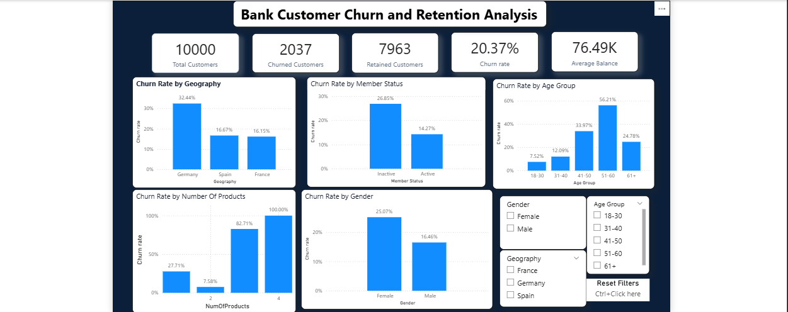

# Bank Customer Churn & Retention Analysis

## Project Overview

Customer churn is an important challenge for banks because losing existing customers can reduce revenue, customer lifetime value, and long-term growth.

This project analyzes a dataset of **10,000 banking customers** to identify customer characteristics associated with churn and provide actionable retention recommendations.

## Business Objective

The analysis was designed to:

- Measure the bank's overall customer churn rate.
- Identify customer segments with higher churn.
- Analyze the relationship between churn and customer characteristics.
- Build an interactive Power BI dashboard for churn monitoring.
- Translate analytical findings into practical retention recommendations.

## Dataset

The dataset contains **10,000 customer records** and 14 fields, including:

- Credit Score
- Geography
- Gender
- Age
- Tenure
- Account Balance
- Number of Products
- Credit Card Ownership
- Active Member Status
- Estimated Salary
- Exited / Churn Status

`Exited = 1` represents a churned customer, while `Exited = 0` represents a retained customer.

## Tools Used

- **Google BigQuery** — data validation, SQL analysis, aggregation, and exploratory analysis
- **SQL** — `COUNT`, `COUNTIF`, `AVG`, `MIN`, `MAX`, `GROUP BY`, `CASE WHEN`, and churn-rate calculations
- **Power BI** — dashboard development, slicers, KPI cards, and interactive visualizations
- **DAX** — measures and calculated columns for churn KPIs and age grouping

## Data Cleaning and Validation

The dataset was validated in BigQuery before analysis.

Checks performed:

- Verified **10,000 total records**.
- Verified **10,000 unique Customer IDs**.
- Confirmed no duplicate Customer IDs.
- Checked analytically relevant columns for missing values.
- Found **no NULL values** in the analyzed fields.
- Validated numerical ranges for age, credit score, tenure, balance, product count, and salary.
- Verified categorical and binary fields for inconsistent values.

No major cleaning changes were required before analysis.

## Key KPIs

| KPI | Result |
|---|---:|
| Total Customers | 10,000 |
| Churned Customers | 2,037 |
| Retained Customers | 7,963 |
| Overall Churn Rate | 20.37% |

## Key Findings

### Geography

Germany recorded the highest churn rate at **32.44%**, compared with **16.15% in France** and **16.67% in Spain**.

### Customer Activity

Inactive customers recorded a churn rate of **26.85%**, while active members had a much lower churn rate of **14.27%**.

### Age

Age was one of the strongest churn-related variables.

| Age Group | Churn Rate |
|---|---:|
| 18–30 | 7.52% |
| 31–40 | 12.09% |
| 41–50 | 33.97% |
| 51–60 | 56.21% |
| 61+ | 24.78% |

Customers aged **51–60** represented the highest-risk age segment.

### Number of Products

Customers with **2 products** had the lowest churn rate at **7.58%**, while customers with 1 product churned at **27.71%**.

Customers with 3 or 4 products showed very high churn rates, but those groups contained far fewer customers, so those percentages should be interpreted cautiously.

### Gender

Female customers recorded a churn rate of **25.07%**, compared with **16.46% among male customers**.

### Other Variables

Credit score, tenure, estimated salary, and credit-card ownership showed comparatively smaller differences in churn rates and appeared to be weaker churn indicators in this dataset.

## Customer Profile Comparison

| Metric | Retained | Churned |
|---|---:|---:|
| Average Age | 37.41 | 44.84 |
| Average Credit Score | 651.85 | 645.35 |
| Average Balance | 72,745.30 | 91,108.54 |
| Average Tenure | 5.03 | 4.93 |
| Average Products | 1.54 | 1.48 |
| Average Estimated Salary | 99,738.39 | 101,465.68 |

Churned customers were older on average and maintained higher balances, while tenure, credit score, and salary differences were comparatively small.

## Business Recommendations

1. **Investigate churn in Germany** by examining regional pricing, customer service issues, competitor activity, and customer feedback.
2. **Re-engage inactive customers** using personalized communication, relevant offers, reminders, and proactive outreach.
3. **Prioritize customers aged 41–60 for retention initiatives**, especially the 51–60 segment.
4. **Explore appropriate cross-selling for one-product customers**, while avoiding the assumption that simply adding more products always reduces churn.

## Power BI Dashboard



The dashboard includes:

- Total Customers
- Churned Customers
- Retained Customers
- Churn Rate
- Average Balance
- Churn Rate by Geography
- Churn Rate by Age Group
- Churn Rate by Active Member Status
- Churn Rate by Number of Products
- Churn Rate by Gender
- Geography, Gender, and Age Group slicers

[Download the Power BI project](dashboard/Bank%20Customer%20Churn%20Analysis.pbix)

## Skills Demonstrated

**SQL:** aggregation, filtering, grouping, `CASE WHEN`, data validation, churn-rate calculations, and segmentation

**Power BI:** Power Query, DAX measures, calculated columns, KPI cards, slicers, sorting, and dashboard design

**Analytics:** data validation, exploratory data analysis, churn segmentation, KPI development, insight generation, and business recommendations

## Repository Structure

```text
bank-customer-churn-analysis/
├── README.md
├── bank_churn_analysis.sql
├── dashboard/
│   ├── Bank Customer Churn Analysis.pbix
│   └── Dashboard.png
└── data/
    └── README.md
```

## Conclusion

The overall churn rate was **20.37%**. The strongest churn-related patterns were observed among customers in Germany, inactive customers, customers aged 41–60, and certain product-count segments.

These findings can help the bank focus retention efforts on higher-risk groups while continuing to investigate the underlying business causes behind those patterns.
